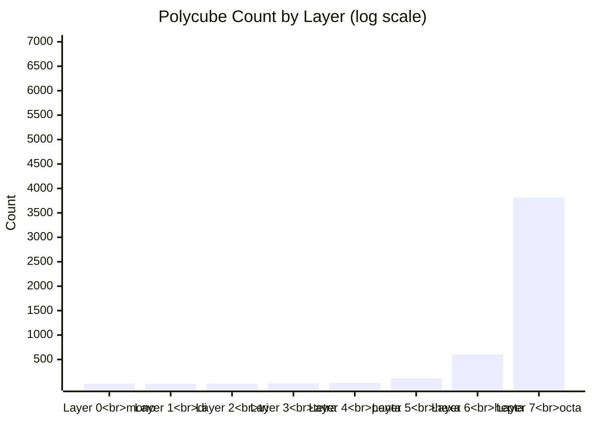
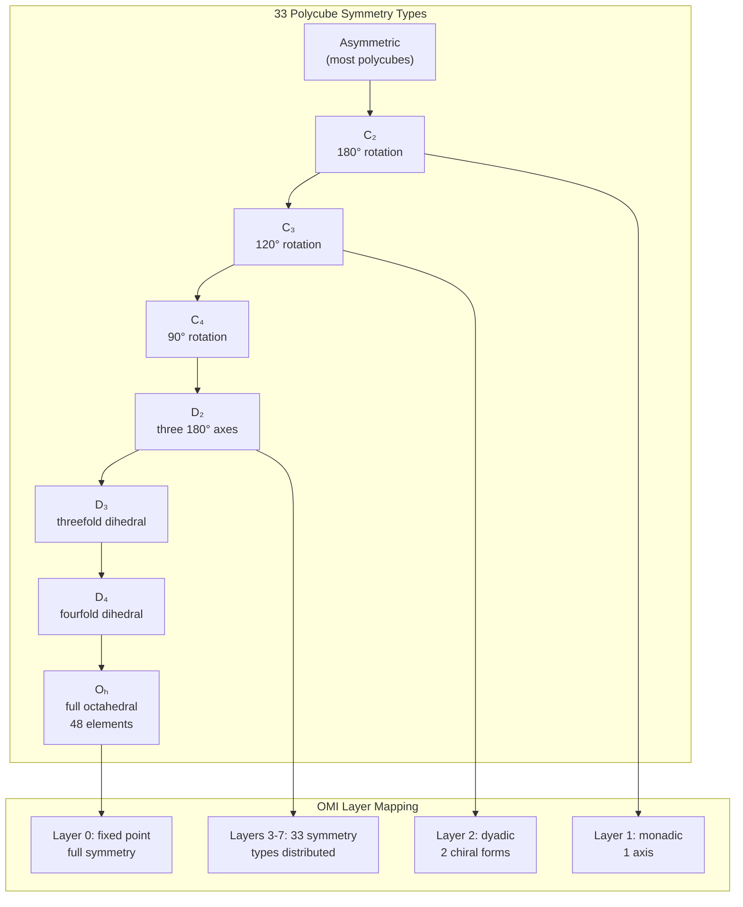

# Polycubes and Symmetry Groups

## Combinatorial Geometry

OMI's factorial layers (segment[6]) map to specific polychoron counts, mirroring the enumeration of polycubes in 3D space:

| Layer | Name | Free Polycubes | One-Sided | Geometric Meaning |
|-------|------|----------------|-----------|-------------------|
| 0 | Fixed Point | 1 | 1 | The origin (monocube) |
| 1 | Monadic | 1 | 1 | A single connection (dicube) |
| 2 | Dyadic | 2 | 2 | Two chiral forms (tricubes) |
| 3 | Octahedral | 7 | 8 | Free polycubes (tetracubes) |
| 4 | 24-cell | 23 | 29 | Pentacube chiral pairs |
| 5 | 120-cell | 112 | 166 | Hexacube symmetry groups |
| 6 | 720-sweep | 607 | 1023 | Heptacube enumeration |
| 7 | Replay Ring | 3811 | 6922 | Octacube full census |

## Chiral Pair Distinction

Unlike polyominoes (2D), polycubes in 3D distinguish mirror reflections because you cannot flip a polycube over to reflect it. OMI encodes both one-sided (reflections distinct) and free (reflections counted together) counts in its addressing scheme.

## Symmetry Types

Polycubes exhibit 33 distinct symmetry types (conjugacy classes of subgroups of the achiral octahedral group). OMI's 8-layer factorial system maps these onto the segment[6] address space, with the Fano plane LL identifier `{0x01..0x07}` selecting the projective symmetry subgroup.
