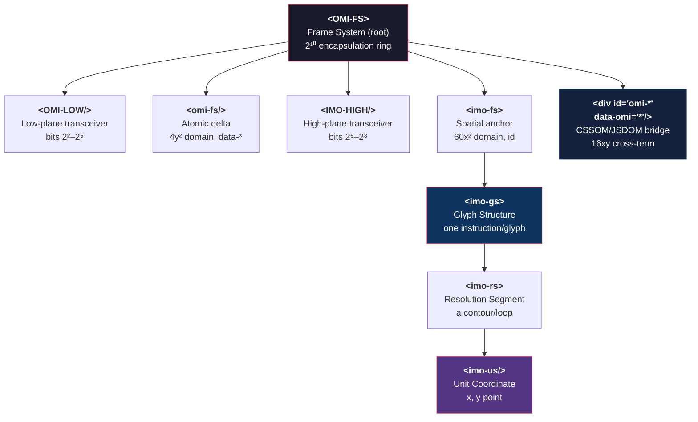

# The DOM Hierarchy: Elements as Register Gates

## The Element Tree

OMI defines a strict hierarchical DOM vocabulary. These are not HTML layout elements — they are **register gates** that encode bit-widths, memory offsets, and coordinate mappings.

## What Each Element Encodes

| Element | Bit Width | Domain | DOM Binding |
|---------|-----------|--------|-------------|
| `<omi />` | 16-bit | Low input (0x03BF) | `char` codepoint |
| `<imo />` | 16-bit | High output (0x039F) | `glyph-id` index |
| `<omi-fs>` | 2^2–2^5 | Atomic delta | `data-*` attributes |
| `<imo-fs>` | 2^6–2^8 | Spatial anchor | `id` attribute |
| `<imo-gs>` | Variable | Glyph structure | Container for contours |
| `<imo-rs>` | 16-bit array | Resolution segments | Contour end-point indices |
| `<imo-us>` | 8/16-bit | Unit coordinates | `x`, `y` points |
| `
` | 16xy | CSSOM/JSDOM bridge | The execution interface |

## The Floating Nodes

Floating `<OMI-* />` and `<IMO-* />` elements are **wormhole portals** — they bypass the standard tree hierarchy entirely. They use:
- **ShadowDOM** — full encapsulation capsules
- **SVG `<use>`** — glyph geometry teleportation
- **innerHTML** — iframe-like state isolation
- **`contenteditable`** — live state modification

Floating nodes pair `id` (x, high-plane) with `data-omi` (y, low-plane) to create the `16xy` cross-term junction. A CSS selector `[data-omi^="low-plane-val-"]` can target any floating node instantly.

## The Cosmic Bit Width Registry

Element word lengths map to specific bit tiers:

| Tier | Width | Element |
|------|-------|---------|
| Low | 22–25 bits | `<omi-fs>`, `<OMI-LOW>` |
| High | 26–28 bits | `<imo-fs>`, `<IMO-HIGH>` |
| Pointer | 29 bits | The cross-term junction `
` |
| Encapsulation | 2^10 (1024-bit) | The full `<OMI-FS>` ring |
