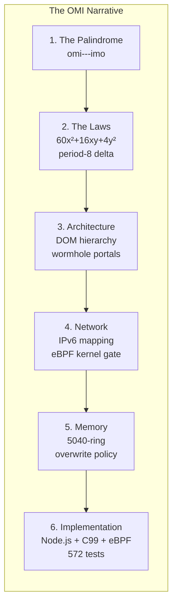

# OMI: Omicron Object Model (o---o)

```
   ___    __  __    _   
  / _ \  |  \/  |  | |  
 | (_) | | |\/| |  | |  
  \___/  |_|  |_|  |_|  
  omi --- imo           ← the palindrome that encodes everything
```

OMI is a **universal hyphenated palindromic mnemonic notation** — a bit-level addressing scheme where `omi` (Greek small omicron, `U+03BF`) and `imo` (Greek capital omicron, `U+039F`) bookend a 128-character frame of 4-character hex blocks, each separated by hyphens that act as bus dividers.

It started as a question about Node.js font parsing. It became a self-hosting meta-circular compiler, an eBPF/XDP kernel packet filter, a sexagesimal spatial geometry system, and a lock-free 5040-slot memory ring — all governed by a single quadratic law: `60x² + 16xy + 4y²`.



## The Ideas, as a Narrative

### [1. FOUNDATIONS](1_FOUNDATIONS/)

The story begins with a palindrome. `omi---imo` read forward is the low gate; read backward is the high gate. The three hyphens are the data bus. The omicron anchors `0x03BF` and `0x039F` are the escape sequences that frame every transmission. Nothing enters or exits without them. The OMI Universal Constant `Ω₀ = 0! = omi---imo` is the zero-point of bounded agreement; the Omi-Ring is the atomic waveform enclosure between those gates: intent captured as declared activity, not merely as voice, image, gesture, or rendered media.

- [1.1 The Palindrome: omi---imo](1_FOUNDATIONS/1.1_THE_PALINDROME.md)
- [1.2 The Omicron Anchors: 0x03BF and 0x039F](1_FOUNDATIONS/1.2_THE_OMICRON_ANCHORS.md)
- [1.3 The Omi-Ring: Atomic Waveform Enclosure](1_FOUNDATIONS/1.3_THE_OMI_RING.md)
- [1.4 The OMI Universal Constant: Ω₀ = 0! = omi---imo](1_FOUNDATIONS/1.4_THE_OMI_UNIVERSAL_CONSTANT.md)

### [2. MATH](2_MATH/)

From the palindrome emerged two laws. The **Quadratic Law** `60x² + 16xy + 4y²` maps high-plane `id` (x) to low-plane `data-*` (y) through a sexagesimal bridge. The **Delta Law** `rotl(x,1) XOR rotl(x,3) XOR rotr(x,2) XOR C` generates period-8 orbits — each orbit is a cycle through the 8 segments of an OMI frame. The base-60 system ensures every coordinate subdivision resolves exactly.

- [2.1 The Quadratic Law: 60x² + 16xy + 4y²](2_MATH/2.1_THE_QUADRATIC_LAW.md)
- [2.2 The Delta Law: The Period-8 Engine](2_MATH/2.2_THE_DELTA_LAW.md)
- [2.3 The Sexagesimal System: Base-60](2_MATH/2.3_SEXAGESIMAL_SYSTEM.md)
- [2.4 Polycubes and Symmetry Groups](2_MATH/2.4_POLYCUBES_AND_GROUPS.md)

### [3. ARCHITECTURE](3_ARCHITECTURE/)

The laws needed a physical form. The OMI DOM hierarchy encodes register gates as HTML elements — `<omi />`, `<imo />`, `<omi-fs>`, `<imo-fs>`, `<imo-gs>`, `<imo-rs>`, `<imo-us>`. Floating nodes act as wormhole portals, teleporting state across disconnected contexts via ShadowDOM capsules and SVG references. The whole thing is a meta-circular chronograph compiler — a self-hosting engine where every instruction is also data and every data frame is also code.

- [3.1 The DOM Hierarchy: Elements as Register Gates](3_ARCHITECTURE/3.1_DOM_HIERARCHY.md)
- [3.2 Wormhole Portals: State Teleportation](3_ARCHITECTURE/3.2_WORMHOLE_PORTALS.md)
- [3.3 The Meta-Circular Chronograph Compiler](3_ARCHITECTURE/3.3_META_CIRCULAR_COMPILER.md)

### [4. NETWORK](4_NETWORK/)

An IPv6 address is 128 bits. An OMI frame is 128 bits. They are the same width, so an OMI frame lives directly in an IPv6 source address. Every 16-bit colon-delimited group is one OMI segment. `RULES.omi` encodes the axiomatic constraint system — over 60 rules mapping segments to service buses, factorial strides, barcode carriers, and boot signatures. The eBPF/XDP kernel gate validates every incoming frame at NIC driver speed: Gate 1 checks the quadratic surface, Gate 2 runs the Fano delta resolver. Invalid frames are dropped before they touch userspace.

- [4.1 IPv6 Frame Mapping](4_NETWORK/4.1_IPv6_FRAME_MAPPING.md)
- [4.2 RULES.omi: The Axiomatic Rule Directory](4_NETWORK/4.2_RULES_OMI.md)
- [4.3 The eBPF/XDP Kernel Gate](4_NETWORK/4.3_eBPF_KERNEL_GATE.md)

### [5. MEMORY](5_MEMORY/)

The 5040-slot ring buffer (`7!` slots, 64 bits each) is the winding ledger. Memory advancement is a function of orbital distance — the Delta Law resolver determines how far the cursor moves. The overwrite policy enforces epoch-based safety: cold slots are overwritten freely, warm slots require re-verification, corrupt slots are reclaimed.

- [5.1 The Ring Indexer](5_MEMORY/5.1_RING_INDEXER.md)
- [5.2 Ring Overwrite Policy](5_MEMORY/5.2_OVERWRITE_POLICY.md)

### [6. IMPLEMENTATION](6_IMPLEMENTATION/)

Three runtimes implement the same ABI surface. The Node.js `PalindromicOmiEngine` is the reference compiler. The C99 core compiles to a 2.7 KB WASM module with byte-level equivalence. The eBPF variant compiles to a 14.7 KB ELF object that JITs to 1.5 KB of native kernel code. All 572 tests pass across all implementations. The genesis frame `0100-03bf-7c00-2b01-2f01-1434-039f-01ff` is mathematically locked — frozen at slot 1504 on the replay ring.

- [6.1 The Node.js Compiler](6_IMPLEMENTATION/6.1_NODEJS_COMPILER.md)
- [6.2 The C99 Core: Minimal WASM Substrate](6_IMPLEMENTATION/6.2_C99_CORE.md)
- [6.3 The Test Suite: 572 Passing](6_IMPLEMENTATION/6.3_TEST_SUITE.md)

---

### Projection Bridge

The `omi---imo` palindrome defines an addressed traversal from low-side source to high-side object and back through inversion. GUI renderers may expose that same validated state in two views:

```
linear:       omi → payload → imo
hierarchical: FS → GS → RS → US
```

The linear view preserves replay/source-object order. The hierarchical view preserves containment/scope order.

This bridge is projection guidance only. It does not add validation authority or replace Q_frame, Omilog receipts, Q_xy, POS graph behavior, WordNet synset centroid identity, or canonical document layer ordering. See [Section 13 — Linear and Hierarchical GUI Projection](#13-linear-and-hierarchical-gui-projection) and the object model bridge section for the full note.

---

### Omi-Ring Stack

The Universal Constant gives the zero-point frame:

```text
Ω₀ = 0! = omi---imo
Ω₀ bounds.
Q(x,y) projects.
```

Omi-Ring replaces the talisman language with an addressable enclosure model: the Ring is the atomic waveform boundary of `omi---imo`, the Portal is the public projection, and the Mirror is the introspective recovery view. OMI does not force interpretation; it makes interpretation addressable.

```text
Omi-Dome -> Omi-Sense -> Omi-Ring -> Omi-Portal / Omi-Mirror
space       intent       enclosure   public / introspective views
```

Omi-Light carries wavelength, Omi-Sound carries intonation, and Omi-Gnomon orients the light field with `Omi-Gnomon(aA) = rRgGbBaA`. Representation is not authority; representation is a recoverable view under rules. See [1.3 The Omi-Ring](1_FOUNDATIONS/1.3_THE_OMI_RING.md) and [1.4 The OMI Universal Constant](1_FOUNDATIONS/1.4_THE_OMI_UNIVERSAL_CONSTANT.md).

---

## The Specification

### 1. The Enclosure Ring — `0x03BF` · `0x039F`

Every instruction is a 128-byte (2¹⁰-bit) long-word bounded by invertible Unicode anchors:

| Anchor | Value | Name | Role |
|--------|-------|------|------|
| `omi-` | `0x03BF` | Greek small omicron (ο) | Forward spin, little-endian BOM, LTR layout |
| `-imo` | `0x039F` | Greek capital omicron (Ο) | Reverse spin, big-endian BOM, RTL state recovery |

The payload splits by hyphens into 4-character hex words (16-bit registers):

```
03BF-AAAA-BBBB-CCCC-039F
```

Reversing the frame reverses its interpretation without destroying structure. See [1.1 The Palindrome](1_FOUNDATIONS/1.1_THE_PALINDROME.md) and [1.2 The Omicron Anchors](1_FOUNDATIONS/1.2_THE_OMICRON_ANCHORS.md).

---

### 2. The Delta Law — Period-8 State Engine

```text
Δ(x) = rotl(x, 1) ⊕ rotl(x, 3) ⊕ rotr(x, 2) ⊕ C
```

**Properties:** rotations (not shifts) preserve the full 16-bit register; XOR gives reversibility; the constant `C = 0x5A3C` breaks the zero fixed-point; `& 0xFFFF` masks to word width.

Period 8: Δ⁸(x) = x for all 16-bit values. This partitions the 2¹⁶ state space into cycles of length dividing 8 — matching the decimal repeating sequence of 1/73:

```text
1/73 = 0.01369863...
B = [0, 1, 3, 6, 9, 8, 6, 3],  W = ΣB = 36
(epoch, phase) = divmod(position, 36)
```

See [2.2 The Delta Law](2_MATH/2.2_THE_DELTA_LAW.md) and [2.3 Sexagesimal System](2_MATH/2.3_SEXAGESIMAL_SYSTEM.md).

---

### 3. The Binary Quadratic Perceptron — `60x² ± 16xy + 4y²`

Each coefficient has a structural role in the DOM model:

| Term | Domain | DOM Mapping | Coefficient Rationale |
|------|--------|-------------|----------------------|
| `4y²` | Low-side `omi-` | `data-*` attributes, atomic data | 4 = 2², half-precision width |
| `60x²` | High-side `-imo` | `id` selector, stable identity | 60 = 2²·3·5, highly composite |
| `16xy` | Cross-term meeting plane | CSSOM + JSDOM shared address | 16 = 2⁴, full word boundary |

The sign `+`/`–` is determined by `unicode-bidi`: `direction: ltr` → `+16xy` (forward spatial evolution), `direction: rtl` → `-16xy` (inverse state recovery).

See [2.1 The Quadratic Law](2_MATH/2.1_THE_QUADRATIC_LAW.md).

---

### 4. The Part-of-Speech and Feature Matrix

The lower 2⁴ half-precision space handles linguistic grammar features via exact bitmasks:

| Class | Bitmask | Category |
|-------|---------|----------|
| `NOUN` | `0x1000` | Open class element frame |
| `VERB` | `0x2000` | Open class action frame |
| `ADJECTIVE` | `0x3000` | Closed class property frame |
| `ADVERB` | `0x4000` | Closed class vector frame |
| `OPEN` / `CLOSED` | `0x0100` / `0x0200` | Open/closed class marker |
| `LEXICAL` / `INFLECTIONAL` | `0x0010` / `0x0001` | Lexical / inflectional flag |

See [2.3 Sexagesimal System](2_MATH/2.3_SEXAGESIMAL_SYSTEM.md) and [3.1 DOM Hierarchy](3_ARCHITECTURE/3.1_DOM_HIERARCHY.md).

---

### 5. SpectrumDOM — The G(AA) Color Graph

Every interface node is a continuous wavelength-field matrix:

```text
G(AA) = (V:RR, E:GG, I:BB, A:AA)
```

| Component | Source | Width | DOM Mapping |
|-----------|--------|-------|-------------|
| **V:RR** (Vertex Red) | `4y²` Atomic Delta field | 2⁴ | PoS features, lexical rules |
| **E:GG** (Edge Green) | `16xy` Dialectic Combinator | 2⁸ | ASCII character codes |
| **I:BB** (Intensity Blue) | `60x²` Cosmic Synset pointer | 2⁸ | WordNet graph offsets |
| **A:AA** (Alpha) | `unicode-bidi` spatial shift | 2⁸ | Transparency → shift multiplier |

When `direction: rtl` fires, the alpha channel becomes an active mathematical shift multiplier, inverting the color spectrum to trace provenance backward without a log cache.

**High Definition** (forward spin, `+16xy`):
```css
div[id^="omi-"][style*="direction: ltr"] { unicode-bidi: bidi-override; mix-blend-mode: screen; }
```

**Low Definition** (inverse spin, `-16xy`):
```css
div[id^="imo-"][style*="direction: rtl"] { unicode-bidi: embed; mix-blend-mode: difference; filter: hue-rotate(180deg); }
```

See [3.1 DOM Hierarchy](3_ARCHITECTURE/3.1_DOM_HIERARCHY.md) and [3.2 Wormhole Portals](3_ARCHITECTURE/3.2_WORMHOLE_PORTALS.md).

---

### 6. The 2¹⁰ Omicron Encapsulation Ring — 1024-Bit Frame

Inside each 1024-bit (128-byte) instruction, powers of two act as interpretation layers:

```text
2¹ through 2⁵  = low atomic memory / flags / data (4y² domain)
2⁶ through 2⁸  = high vector memory / orientation (60x² domain)
2⁹             = cross-bus pointer (16xy domain)
2¹⁰            = omicron ring boundary
```

The runtime memory pool is a `SharedArrayBuffer(1024)` — 8 discrete instruction slots of 128 bytes each, aligned to L1/L2 cache lines.

See [3.3 Meta-Circular Compiler](3_ARCHITECTURE/3.3_META_CIRCULAR_COMPILER.md) and [5.1 Ring Indexer](5_MEMORY/5.1_RING_INDEXER.md).

---

### 7. JSON Canvas 1.0 Integration

OMI compiles directly to the JSON Canvas spec. The 2² Tangential Type classification splits the network into four application domains:

| Index | Type | Role |
|-------|------|------|
| `0x00` | `text` | String structures, character code arrays |
| `0x01` | `file` | Continuous file blocks, NLP text records |
| `0x02` | `link` | Remote address targets, decentralized routes |
| `0x03` | `group` | System matrix configurations, parent/child layouts |

**Color mapping:** Low space → 6 integer canvasColor presets (`"1"` red through `"6"` purple). High space → 6-character hex colors (`#RRGGBB`).

**Directional axis mapping:**

```text
0x1C (FS) → TOP   0x1D (GS) → RIGHT
0x1E (RS) → BOTTOM  0x1F (US) → LEFT
```

See [3.3 Meta-Circular Compiler](3_ARCHITECTURE/3.3_META_CIRCULAR_COMPILER.md) and [4.2 RULES.omi](4_NETWORK/4.2_RULES_OMI.md).

---

### 8. The Four Temporal Operators

| Operator | Layer | Function |
|----------|-------|----------|
| **join** | Facts (2¹) + Rules (2²) | Merge feature/rule block from slot A with cdr pointer from slot B |
| **compose** | Closures (2³) | Ingest text tokens, map PoS, assign instruction slots |
| **parse** | Combinators (2⁴) | Scan webpage structure, trap edge attributes, decode to 128-byte slice |
| **replay** | Cons cells (2⁵) | Lock-free rollback via streaming binary frames onto the canvas bus |

See [3.3 Meta-Circular Compiler](3_ARCHITECTURE/3.3_META_CIRCULAR_COMPILER.md).

---

### 9. The Prime 73 Activation Function — Zero-Drift Feedback

Instead of ReLU/Sigmoid (which introduce floating-point drift), OMI uses a modular period-8 step operation derived from the digits of 1/73:

```text
Output State = Δ(Z(x, y)) mod 2¹⁶
```

**Properties:** (1) integer-only — no floating-point accumulation; (2) deterministic orbits — period-8 across all 2¹⁶ states; (3) bounded HNSW discovery — layer indices recoverable from position via `divmod(position, 36)`.

The **Void-Factorial Identity** bridges discrete combinatorics and continuous mechanics:

```text
0! = 1  ≡  ()! = (60x² ± 16xy + 4y²)
```

The empty cons is the fixed point of factorial closure: `cons() ≠ ()! ⟹ 0 ≠ 1`. A valid instruction can never be a terminal fence; a terminal fence can never pass the quadratic gate.

See [2.2 The Delta Law](2_MATH/2.2_THE_DELTA_LAW.md) and [2.4 Polycubes and Groups](2_MATH/2.4_POLYCUBES_AND_GROUPS.md).

---

### 10. The Fano Resolution — 15-Step Deterministic Bound

Two execution frames governed by Δ_C trace trajectories across the 5040-slot ring. The Fano plane PG(2,2) — 7 points, 7 lines, 3 points per line — guarantees intersection within 15 steps:

```text
max_path = (2 × period) − 1 = 15
```

This is not probabilistic consensus — it is a **deterministic geometric guarantee**. The **Snub-Roll Transformation** acts as a spatial filter: when a stream reaches 2⁴ (16-bit) half-precision limit, the engine cuts cleanly at the `0x7C00` boundary. The `unicode-bidi` function maps full RRGGBBAA (32-bit alpha-blended) inputs to flat RGB (24-bit non-interpreted) fields.

See [4.3 eBPF Kernel Gate](4_NETWORK/4.3_eBPF_KERNEL_GATE.md) and [5.1 Ring Indexer](5_MEMORY/5.1_RING_INDEXER.md).

---

### 11. The 5040 Replay Ring — Factorial Stride

```text
7! = 5040 slots  →  SharedArrayBuffer(5040 × 8) = 40,320 bytes
```

Cursor advancement via atomic compare-exchange: `CAS(old, new)` where `new = (old + steps) mod 5040`. At `ring_pos ≡ 0 mod 5040`, the hard reset fires — `cons() → ()!` loop begins again.

**The 64-bit receipt format:**

| Bits | Field |
|------|-------|
| 0–15 | Provenance (LL) |
| 16–31 | Step count |
| 32–47 | NN (low instruction) |
| 48–63 | MM (high instruction) |

See [5.1 Ring Indexer](5_MEMORY/5.1_RING_INDEXER.md) and [5.2 Overwrite Policy](5_MEMORY/5.2_OVERWRITE_POLICY.md).

---

### 12. Floating Wormhole Nodes & Hierarchical FS Nodes

**Floating nodes** (portal elements for wormhole state movement across layout boundaries):

```html
<OMI-* /> <IMO-* /> <svg></svg>
<template shadowrootmode="open"></template> <iframe></iframe>
```

**Hierarchical FS nodes** (sexagesimal orientation):

```html
<OMI-FS><omi-fs /><IMO-FS><imo-fs><imo-gs><imo-rs><imo-us /></imo-rs></imo-gs></imo-fs></IMO-FS></OMI-FS>
```

| Element | Role |
|---------|------|
| `OMI-FS` / `omi-fs` | Outer field system / low atomic field |
| `IMO-FS` / `imo-fs` | High orientation field / frame system |
| `imo-gs` | Glyph / geometry / graph structure |
| `imo-rs` | Resolution segment |
| `imo-us` | Unit state |

See [3.2 Wormhole Portals](3_ARCHITECTURE/3.2_WORMHOLE_PORTALS.md) and [3.1 DOM Hierarchy](3_ARCHITECTURE/3.1_DOM_HIERARCHY.md).

---

### 13. Linear and Hierarchical GUI Projection

OMI GUI projections expose the same validated addressed state in two inspectable forms: a linear traversal stream and a hierarchical containment tree.

This is projection guidance only. It does not add validation authority, replace Q_frame, bypass Omilog receipts, redefine Q_xy, alter POS graph behavior, change WordNet synset centroid identity, or reorder canonical document layers.

| Projection | Preserves | GUI Surface | Canonical Meaning |
|------------|-----------|-------------|-------------------|
| Linear traversal stream | Replay/source-object order | `omi → payload → imo`, ids, `data-omi-*`, JSON Canvas node order | Shows how addressed state is walked, replayed, and inspected |
| Hierarchical containment tree | Scope/document order | `FS → GS → RS → US`, nested GUI structure, document/context/control/unit layers | Shows where addressed state belongs and how it is contained |

The linear projection preserves traversal order:

```
omi → payload → imo
```

It is appropriate for replay streams, source/object flow, frame inspection, JSON Canvas node order, DOM ids, `data-omi-*` attributes, and Omilog-visible sequence review.

The hierarchical projection preserves containment order:

```
FS → GS → RS → US
```

It is appropriate for document layers, context boundaries, control surfaces, unit projections, nested GUI structure, and scoped object containment.

Both projections remain downstream of validation:

```
validate → resolve → project → inspect
```

A GUI may render the two forms side by side, but neither form becomes the source of truth. The source of truth remains the accepted frame, its receipts, its graph identity, and its address resolution.

Fonts, glyphs, Unicode codepoints, and visual typography may serve as precision carriers for GUI readability. They can help align mnemonic inspection, codepoint display, and visual debugging. They are not semantic authority. A rendered glyph is only a carrier. The validated state is determined by canonical frame validation, Omilog receipt evidence, graph identity, and x/y address resolution.

```
linear view       = how the state is traversed
hierarchical view = where the state is contained
validation        = why the state is accepted
```

See [3.1 DOM Hierarchy](3_ARCHITECTURE/3.1_DOM_HIERARCHY.md), [3.2 Wormhole Portals](3_ARCHITECTURE/3.2_WORMHOLE_PORTALS.md), and [3.3 Meta-Circular Compiler](3_ARCHITECTURE/3.3_META_CIRCULAR_COMPILER.md).

---

### 14. WebMedia Multiplexing — Chiral Stream Routing

| MIME Type | Role |
|-----------|------|
| `text/x-omi-mnemonic` | Text strings, lexicon definitions, Prolog fact-graphs |
| `application/x-omi-cbos` | Raw Chiral Binary Object Streams (CBOS) over hardware caches |

See [4.1 IPv6 Frame Mapping](4_NETWORK/4.1_IPv6_FRAME_MAPPING.md).

---

### 15. The Prolog Tokenizer — Clause-to-Frame Pipeline

```text
Prolog clause → POS tag → 4y² feature pack → 16xy combinator inject → 60x² synset address → 128-byte frame
```

1. Accepts Prolog fact strings (e.g. `"FACT_SYNSET_NODE"`)
2. Maps grammar types to POS bitmasks (NOUN → 0x1100, VERB → 0x2100)
3. First character code → 16xy combinator byte
4. Synset address → 24-bit 60x² pointer field
5. ASCII control codes for directional axis positioning
6. Writes 128-byte frame bounded by 0x03BF · 0x039F

See [6.1 Node.js Compiler](6_IMPLEMENTATION/6.1_NODEJS_COMPILER.md) and [6.2 C99 Core](6_IMPLEMENTATION/6.2_C99_CORE.md).

---

### 16. The Omni-Router — Deployment Blueprint

The primary deployment blueprint reads declarative markdown and compiles directly to SpectrumDOM color fields:

1. `SharedArrayBuffer(1024)` — 8 slots × 128 bytes, lock-free shared memory
2. Multi-threaded WASM HNSW convolutions
3. `routeMnemonic()` — instruction ingestion
4. `compileToSpectrumDOM()` — layout tree generation
5. `window.OmiRouter` — DevTools console access

See [6.1 Node.js Compiler](6_IMPLEMENTATION/6.1_NODEJS_COMPILER.md).

---

### 17. Cross-Language Implementation Targets

All four targets produce identical Q(S) outcomes:

| Target | Language | Size | Role |
|--------|----------|------|------|
| Reference | JavaScript | — | Canonical high-level implementation, test oracle |
| Portable | C99 | — | Low-level cross-platform substrate |
| Executable | WebAssembly | 2.7 KB | Compiled runtime artifact |
| Kernel | eBPF/XDP | 14.7 KB ELF → ~1.5 KB JIT | Zero-copy NIC driver packet filter |

See [6.2 C99 Core](6_IMPLEMENTATION/6.2_C99_CORE.md) and [4.3 eBPF Kernel Gate](4_NETWORK/4.3_eBPF_KERNEL_GATE.md).

---

### 18. The Six-Layer Carrier Taxonomy

All carriers satisfy `decode(encode(S)) = S` for structurally valid S:

| Layer | Carriers | Role |
|-------|----------|------|
| **Physical** | ITF (clock), Code39 (guard) | Signal integrity — valid pulse? framed? |
| **Transport** | Codabar → Code128 → Code16K → Code93 | 1D precision ladder (binary16 → binary256) |
| **Geometric** | Aztec (FS), Maxi (GS), JABCode (RS), BeeTag (US) | 2D C0 control plane mapping |
| **Algebraic** | Q(S) = 0 | Branchless quadratic zero-sum structural proof |
| **Projective** | δ_C_LL resolver | Truth-row closure in ≤ 14 steps |
| **Atomic** | CAS cursor | Lock-free 64-bit receipt write |

See [4.2 RULES.omi](4_NETWORK/4.2_RULES_OMI.md).

---

### 19. The Canonical Genesis Frame

```text
BOOT_ADDRESS = 0x7C00
BOOT_SLOT = 0x7C00 mod 5040 = 1504
GENESIS_LL = 0x01
GENESIS_NN = 0x7C00
C = (0x01 × 0x1337) & 0xFFFF = 0x1337
GENESIS_MM = Δ_{0x1337}(0x7C00) = 0x1434
GENESIS_STEPS = 1
```

Canonical frame: `0100-03bf-7c00-2b01-2f01-1434-039f-01ff`

Q(S) = 0, steps = 1. This is the golden accept fixture for all conforming implementations. See [6.3 Test Suite](6_IMPLEMENTATION/6.3_TEST_SUITE.md).

---

### 20. Conformance Requirements

A conforming implementation MUST:

1. Recognize `0x03BF` (omi-) and `0x039F` (-imo) as canonical frame anchors
2. Validate frames via Q(S) = E_var + E_const = 0 as the sole structural predicate
3. Implement Δ(x) = rotl(x,1) ⊕ rotl(x,3) ⊕ rotr(x,2) ⊕ C with C = 0x5A3C
4. Implement the Fano truth resolver with LL-modulated C = (LL × 0x1337) & 0xFFFF, bound ≤ 14 steps
5. Accept the canonical genesis frame with Q(S) = 0 and steps = 1
6. Reject byte-swapped frames (Q(S) ≥ 2×10⁹)
7. Produce identical Q(S) outcomes to the JavaScript reference implementation

See [6.2 C99 Core](6_IMPLEMENTATION/6.2_C99_CORE.md) and [6.3 Test Suite](6_IMPLEMENTATION/6.3_TEST_SUITE.md).

---

### 21. The Omicron Constant and Tetrahedral Packets

`Omega_0 = 16 bits`: one 4-character hex word. Five tetrahedral packet frames live inside that word discipline:

| Packet | Width | Role |
|--------|-------|------|
| facts | `2^1` | assertions and chirality |
| rules | `2^2` | `text`, `file`, `link`, `group` routing |
| closures | `2^3` | scoped bindings |
| combinators | `2^4` | ASCII/Unicode `16xy` junction |
| cons | `2^5` | car/cdr pointers |

The canonical browser selector is hyphenated:

```text
omi-CANONICAL_MAPPING_OF_0x0000_TO_0xAA55
```

### 22. Browser Runtime Loop

The local runtime uses `SharedArrayBuffer(1024 * 16)` as a 16 KB bus: 128 slots, each one 128 bytes. Static assembly declarations compile into slots, slots project into DOM/SpectrumDOM, and live DOM nodes parse back into slots.

Transaction primitives:

```text
join -> compose -> parse -> replay
```

`unicode-bidi` activates chirality: `omi-*` + `direction: ltr` runs forward `+16xy`; `imo-*` + `direction: rtl` runs inverse `-16xy`.

### 23. Void-Factorial Cons Identity

```text
0! = 1
()! = 60x^2 ± 16xy + 4y^2
cons = 60x^2 ± 16xy + 4y^2
```

The empty cons is not a dead slot. It is the unity seed that expands into a valid quadratic surface.

---

### 24. The Minimal Canonical Statement

```text
A frame is valid iff Q(S) = 0.
A valid frame yields one truth row (LL, NN, MM).
A truth row is accepted iff it resolves under δ_C_LL within the bounded step window.
An accepted row advances the 5040-slot replay cursor by its step count using atomic compare-exchange.
The resulting slot stores a 64-bit receipt.

Ο bounds. ο executes. -- compresses zero. CIDR scopes.
/// frames projection (FS 0x1C). \\ constrains boundary (RS 0x1E).
Omicron inverts (0x5A3C). δ evaluates (period 8).
() empties. ()! closes. 0! seeds. 60 counts. 720 sweeps. 5040 replays.
```

---

## Consumer Use Case: Open-World Decentralized Web Portal

An **open-world decentralized web portal** is a consumer-facing OMI application where a user enters a shared digital space through an ordinary browser, but the objects inside that space are not locked to one server, one app, one account system, or one feed.

The portal behaves like a normal website on the surface:

```text
open page → browse objects → inspect details → post/update → share/link → replay history
```

But underneath, every visible object is an addressed OMI state:

```text
omi → payload → imo
```

The consumer does not need to understand the full protocol. They experience OMI as a portable portal where pages, cards, files, notes, events, identities, maps, products, posts, and conversations can be inspected in two ways:

```text
linear view       = what happened, in what order
hierarchical view = where it belongs, in what context
```

The open-world portal is therefore not just a webpage. It is a **decentralized object window**.

### 1. Consumer Story

A user opens the portal on their phone or laptop.

They see a world of objects:

- people
- events
- posts
- notes
- maps
- files
- products
- services
- local groups
- routes
- tasks
- receipts
- claims
- knowledge cards

Each object can be clicked, expanded, followed, copied, shared, verified, or replayed.

To the consumer, the portal feels like a mix of:

```text
browser + map + wiki + wallet + canvas + feed + local bulletin board
```

But the key difference is this:

> The portal does not merely show content. It shows addressed state.

Every card has an identity. Every edit can produce a receipt. Every object can be viewed as part of a timeline, a graph, a document tree, or a local portal.

### 2. Open-World Meaning

"Open-world" means the portal assumes the world is not complete.

A normal app usually behaves like a closed database:

```text
only this app's users
only this app's posts
only this app's IDs
only this app's permissions
only this app's feed
```

An OMI open-world portal behaves differently:

```text
new objects may appear
unknown peers may publish
external files may attach
local devices may join
offline state may later sync
multiple naming systems may coexist
different portals may project the same object
```

So the portal does not assume it owns the truth. It only asks:

```text
Can this object be addressed?
Can this frame be validated?
Can this receipt be replayed?
Can this object be projected safely?
Can the consumer inspect where it came from?
```

That is the consumer value: the user is not trapped inside one platform's database.

### 3. The Main Consumer Experience

The portal has four major consumer modes.

#### 3.1 Discover

The user enters through a homepage, map, QR code, shared link, local mesh node, event page, or personal dashboard.

They discover objects as cards:

```text
event card
person card
place card
file card
post card
route card
service card
product card
discussion card
```

Each card has normal UI fields:

```text
title
summary
author/source
time
location/context
status
actions
```

But each card also has OMI fields:

```text
omi address
frame receipt
source path
object path
linear replay
hierarchical containment
```

The consumer can ignore those fields until needed.

#### 3.2 Inspect

When the user opens an object, the portal shows two projections.

The **linear projection** answers:

```text
What happened?
What came before this?
What does this replay from?
What is the source/object flow?
```

Example:

```text
omi → event payload → update payload → comment payload → imo
```

The **hierarchical projection** answers:

```text
Where does this belong?
What contains it?
What context controls it?
What unit is being inspected?
```

Example:

```text
Community
  Bike Ride
    Route
      Stop
        Comment
```

In OMI notation:

```text
FS → GS → RS → US
```

The consumer can switch between these views:

| View         | Consumer Question          | Portal Projection          |
|--------------|----------------------------|----------------------------|
| Linear       | "What happened?"           | replay stream              |
| Hierarchical | "Where is it?"             | containment tree           |
| Graph        | "What is it connected to?" | object links               |
| Receipt      | "Can I trust this?"        | validation/replay evidence |
| Portal       | "Can I open it elsewhere?" | portable object projection |

#### 3.3 Act

The user can interact with the object:

```text
save
share
reply
annotate
verify
join
buy
reserve
donate
route
fork
mirror
publish
```

Each action becomes a new addressed state instead of a hidden platform-side mutation.

For example, joining an event does not merely update a server database. It can produce a small receipt:

```text
user X joined event Y at time Z under context C
```

That receipt can be displayed in the user's portal, the event organizer's portal, and any trusted mirror that accepts the same validated object.

#### 3.4 Port

The "portal" part means the object can move across surfaces.

The same object can appear as:

```text
web card
map pin
JSON Canvas node
QR code
SVG badge
ShadowDOM widget
local file
mesh message
receipt row
timeline event
```

The object is not identical to its visual rendering. The rendering is only a carrier.

This preserves the OMI rule:

```text
carrier ≠ authority
projection ≠ validation
glyph ≠ meaning
```

The object's authority comes from its addressed state, receipts, and validation path.

### 4. Example Scenario: Local Event Portal

A community bike ride organizer creates an event.

The consumer sees:

```text
Sunday Night Lights Ride
Meetup: Popeyes parking lot
Route: Vermont Ave Florence → Imperial and back
Distance: 3.2 miles one way
Food: hot dogs, hot links, sodas
Status: active
```

Underneath, the portal treats the event as an OMI object:

```text
omi-event
  payload: ride details
  context: local community
  route: map object
  author: organizer identity
  receipts: updates, RSVPs, comments
imo-event
```

A rider opens the event and sees:

#### Linear view

```text
event created
route added
food info added
safety note added
rider joined
speaker note added
time updated
```

#### Hierarchical view

```text
Community
  Sunday Night Lights
    Ride
      Meetup
      Route
      Safety
      Food
      Riders
      Updates
```

#### Map view

```text
start point
turnaround point
route trace
nearby posts
local vendors
live updates
```

#### Receipt view

```text
who posted what
when it changed
which frame accepted it
which portal mirrored it
```

The consumer does not need to know the protocol to benefit. They just get a portable event page that can be opened, mirrored, verified, and replayed.

### 5. Example Scenario: Personal Knowledge Portal

A user saves a document, a note, and a conversation into their personal OMI portal.

The portal shows the objects as a canvas:

```text
Note A → Topic B → File C → Source D
```

The user can inspect the same knowledge in two modes:

#### Linear replay

```text
I found this source
I wrote this note
I linked this idea
I revised this claim
I shared this object
```

#### Hierarchical containment

```text
Project
  Topic
    Claim
      Evidence
        Source
```

This is useful because a consumer often needs both:

```text
timeline = how I got here
tree     = where this belongs
```

A normal notes app may preserve one or the other. The OMI portal preserves both as projections of the same addressed state.

### 6. Example Scenario: Local Marketplace Portal

A vendor publishes a mobile cart menu.

The consumer sees:

```text
Item: Hot dog
Price: $2
Location: event route
Availability: tonight
Payment: cash/donation
```

The OMI object contains:

```text
seller identity
item identity
price state
location state
availability state
receipt history
```

If the vendor changes the price or runs out of stock, the update is a new state, not a silent overwrite.

The consumer can inspect:

```text
current menu
previous menu
vendor identity
event relationship
location context
receipt trail
```

That creates a decentralized local commerce portal where small vendors do not need a full platform account structure to publish inspectable objects.

### 7. Trust Model for Consumers

The consumer should not be forced to trust the portal operator blindly.

The portal should show simple trust labels:

```text
Accepted
Unverified
Conflicting
Expired
Mirrored
Local-only
Replayed
Rejected
```

A consumer-facing trust panel could say:

```text
This object passed frame validation.
This object has 3 receipts.
This object was mirrored by 2 peers.
This object has 1 conflicting update.
This object is local-only and not yet synced.
```

The consumer sees plain language, while the protocol maintains the deeper validation path.

The rule is:

```text
simple labels for humans
receipts for machines
replay for verification
```

### 8. Identity Without Platform Lock-In

In a normal app, identity often means:

```text
login with platform account
profile stored on central server
content owned by platform database
```

In an OMI portal, identity should be object-based:

```text
person object
device object
author key
local handle
portal handle
receipt history
relationship graph
```

A consumer can have multiple identities:

```text
public identity
local event identity
vendor identity
private notebook identity
device identity
```

The portal does not need to collapse all of them into one global account.

That is important for an open-world system because the same person may participate differently in different contexts.

### 9. Consumer Safety and Control

A decentralized portal must not mean "anything can run."

Consumer safety requires strict projection boundaries:

```text
render safely
sandbox portals
sanitize innerHTML
isolate ShadowDOM widgets
show unknown sources
block unsafe scripts
separate carrier from authority
```

Floating wormhole nodes are useful because they let objects appear inside portal surfaces, but they must be treated as projection capsules, not trusted execution by default.

A safe consumer portal should default to:

```text
read-only projection first
interaction second
execution last
```

### 10. Why OMI Matters Here

OMI gives the portal a stable object spine.

The consumer sees:

```text
card
page
map
timeline
canvas
widget
receipt
```

The system sees:

```text
validated frame
x/y address relation
linear projection
hierarchical projection
receipt slot
carrier surface
```

That means the same state can be shown many ways without changing what it is.

This is the main consumer promise:

> One object, many portals, inspectable history, portable context.

### 11. Minimal Consumer Promise

The open-world decentralized web portal should promise five things:

1. **Portability** — objects are not trapped in one app view.
2. **Inspectability** — users can see history, containment, and source.
3. **Replayability** — important actions can be replayed from receipts.
4. **Context** — every object can show where it belongs.
5. **Safety** — projection does not automatically become authority.

In one sentence:

```text
The portal lets consumers browse, trust, and move through decentralized objects as ordinary web pages, while OMI preserves the addressed state, replay order, containment structure, and validation receipts underneath.
```

### 12. Consumer-Facing Interface Sketch

```text
┌─────────────────────────────────────────────────────────────┐
│ Open World Portal                                           │
├─────────────────────────────────────────────────────────────┤
│ Search / Scan / Open / Nearby / My Objects                  │
├─────────────────────────────────────────────────────────────┤
│ Object Card                                                 │
│   Title: Sunday Night Lights Ride                           │
│   Status: Accepted                                          │
│   Source: Local organizer                                   │
│   Context: Community / Bike Ride / Route                    │
├─────────────────────────────────────────────────────────────┤
│ Views                                                       │
│   [Linear Replay] [Hierarchy] [Map] [Graph] [Receipts]      │
├─────────────────────────────────────────────────────────────┤
│ Linear Replay                                               │
│   created → route added → safety note → riders joined       │
├─────────────────────────────────────────────────────────────┤
│ Hierarchy                                                   │
│   Community → Event → Route → Stop → Comment                │
├─────────────────────────────────────────────────────────────┤
│ Actions                                                     │
│   Save | Join | Share | Mirror | Verify | Export            │
└─────────────────────────────────────────────────────────────┘
```

### 13. Portal Architecture in One Flow

```text
consumer action
  ↓
portal UI
  ↓
object projection
  ↓
OMI frame / object address
  ↓
validation + receipt
  ↓
linear replay stream
  ↓
hierarchical containment tree
  ↓
portable carrier output
```

The consumer-facing app should hide the complexity until the user asks to inspect it. The protocol should remain visible enough that power users can verify, export, mirror, and replay objects without depending on a single platform.

The shortest version: **the consumer portal is a normal-looking web portal for open-world objects, but every object can be inspected as timeline, tree, graph, receipt, and portable carrier.**

---

## Agreement Is All You Need: The OMI Open-World Portal Model

### Abstract

The open-world decentralized web does not need a single platform to decide what is true. It needs a shared way to turn user actions, objects, claims, links, events, and identities into validated, replayable, inspectable state.

That is the role of the **Omi Object Model**.

In OMI, **agreement** is not passive approval, social consensus, or majority vote. Agreement is the moment an object becomes structurally valid, addressable, replayable, and projectable across portals.

A consumer does not experience this as math. A consumer experiences it as a normal web portal:

```text
open → browse → inspect → act → verify → share → replay
```

But underneath, every visible object is an OMI object:

```text
omi → payload → imo
```

The portal may show the object as a card, map pin, canvas node, QR code, SVG widget, local file, timeline event, or receipt row. Those are only projections. The authority is the accepted frame, its receipts, its address resolution, and its graph identity.

The claim of this article is simple:

```text
Agreement is all you need because agreement is the bridge from open-world uncertainty to validated shared structure.
```

### 1. The Consumer Problem

Today's web is full of portals, but most portals are closed worlds.

A closed-world platform assumes:

```text
this app owns the account
this app owns the feed
this app owns the database
this app owns the object ID
this app decides the truth state
```

That is convenient, but it creates lock-in. A post cannot naturally become a map object. A note cannot naturally become an event object. A receipt cannot naturally become a portable proof. A local community page cannot easily move between a browser, phone, QR code, mesh node, and personal archive without losing structure.

Consumers do not only need content. They need portable context.

They need to know:

```text
What is this object?
Where did it come from?
Who changed it?
Can I trust it?
Can I open it somewhere else?
Can I replay what happened?
Can I see where it belongs?
```

An open-world portal must answer those questions without requiring one central platform to own everything.

### 2. Agreement as Consumer Trust

In OMI, agreement means a piece of shared intelligence has been lowered into validated structure.

For the consumer, this becomes a trust path:

```text
someone says something
  ↓
the portal frames it
  ↓
the frame validates
  ↓
the truth row resolves
  ↓
a receipt is recorded
  ↓
the object becomes inspectable
  ↓
the object can be projected
```

So agreement is not merely:

```text
I like this
I approve this
I voted for this
the platform accepted this
```

Agreement is:

```text
this object has a valid frame
this object has a replay path
this object has an address relation
this object can be inspected
this object can be projected without becoming corrupted
```

For consumers, the portal can translate that into plain labels:

```text
Accepted
Unverified
Conflicting
Expired
Mirrored
Local-only
Rejected
Replayed
```

A normal user sees simple status. A power user can inspect the receipt, frame, replay path, and graph relation.

### 3. Disagreement as an Unresolved Path

In a closed platform, disagreement often becomes moderation, argument, deletion, or ranking.

In OMI, disagreement is treated as an unresolved path.

A disagreement means something structural is missing:

| Disagreement                | Missing Structure          | Portal Output                            |
|-----------------------------|----------------------------|------------------------------------------|
| "What is this?"             | Missing boundary           | Create or reveal object address          |
| "Who said this?"            | Missing source             | Show identity or provenance object       |
| "Where does this belong?"   | Missing containment        | Show hierarchy path                      |
| "What changed?"             | Missing replay             | Show linear event stream                 |
| "Why trust it?"             | Missing receipt            | Show validation evidence                 |
| "What does this word mean?" | Missing semantic identity  | Resolve POS / synset / graph node        |
| "Which version is current?" | Missing conflict rule      | Show competing receipts                  |
| "Can I open it elsewhere?"  | Missing carrier projection | Export as card, canvas, QR, SVG, or file |

This is the constructive doctrine:

```text
disagreement → missing structure → new object/path/test/receipt
```

The portal does not need to erase disagreement. It needs to route disagreement into inspectable structure.

### 4. The Open-World Portal

An OMI open-world portal is a normal-looking web app that displays decentralized objects.

The consumer sees:

```text
cards
profiles
events
maps
posts
notes
files
routes
products
services
receipts
comments
local groups
```

The OMI layer sees:

```text
validated frames
addressed payloads
source/object relations
linear replay streams
hierarchical containment trees
graph links
receipt rows
carrier projections
```

The same object can appear as:

```text
web card
JSON Canvas node
map pin
SVG element
QR code
local file
portal widget
timeline entry
receipt row
```

The consumer does not have to learn the protocol. The portal gives them ordinary actions:

```text
save
share
join
reply
mirror
verify
export
follow
fork
annotate
```

But each action can produce a new addressed state instead of a hidden server-side mutation.

### 5. The Two Consumer Views: Linear and Hierarchical

Every portal object should be inspectable in two basic forms.

#### 5.1 Linear View

The linear view answers:

```text
What happened?
In what order?
What was replayed?
What led to this state?
```

In OMI terms:

```text
omi → payload → imo
```

For an event, the consumer might see:

```text
event created
route added
food note added
safety note added
rider joined
time updated
comment posted
```

The linear view is a replay stream. It is how the object moved.

#### 5.2 Hierarchical View

The hierarchical view answers:

```text
Where does this belong?
What contains it?
What context controls it?
What unit am I inspecting?
```

In OMI terms:

```text
FS → GS → RS → US
```

For the same event, the consumer might see:

```text
Community
  Bike Ride
    Route
      Stop
        Comment
```

The hierarchical view is a containment tree. It is where the object belongs.

#### 5.3 Projection Is Not Authority

Both views are projections. They help users inspect the object, but they do not validate the object.

The rule is:

```text
validate → resolve → record → project → inspect
```

Not:

```text
render → believe
```

The portal may use fonts, glyphs, codepoints, color graphs, SVG, ShadowDOM, JSON Canvas, or QR codes. Those are carriers. They do not become semantic authority.

### 6. The Object Agreement Pipeline

A consumer action becomes agreement only after passing through the OMI pipeline.

```text
consumer action
  ↓
portal object
  ↓
OMI frame
  ↓
Q_frame validation
  ↓
truth-row resolution
  ↓
receipt write
  ↓
Q_xy projection
  ↓
linear and hierarchical GUI views
```

The user sees a clean interface. The protocol preserves the proof path.

This means a user can click "join event," "save note," "mirror post," or "verify object," and the portal can convert that into a structured state change.

Example:

```text
User joins a bike ride.
```

Closed platform interpretation:

```text
server updates RSVP table
```

OMI portal interpretation:

```text
person object
  agrees to
event object
  under context
local community ride
  with receipt
timestamp / source / replay slot
```

The action becomes portable state.

### 7. Local Event Use Case

A community organizer creates a bike ride portal.

The consumer sees:

```text
Sunday Night Lights Ride
Meetup: Popeyes parking lot
Route: Vermont Ave Florence → Imperial and back
Distance: 3.2 miles one way
Food: hot dogs, hot links, sodas
Status: active
```

Behind the interface, the event is an object:

```text
omi-event
  payload: ride details
  source: organizer
  context: local community
  route: map path
  receipts: updates / joins / comments
imo-event
```

A rider opens the portal and gets five views:

| View          | Consumer Value            |
|---------------|---------------------------|
| Card          | Fast summary              |
| Linear replay | What changed and when     |
| Hierarchy     | Where the object belongs  |
| Map           | Where to go               |
| Receipts      | Why the object is trusted |

If the route changes, the old version is not silently erased. The new update becomes a new addressed state. Consumers can inspect the update path.

The portal can say:

```text
Route updated 12 minutes ago.
Accepted frame.
Mirrored by 2 peers.
Previous route still replayable.
```

That is consumer-facing agreement.

### 8. Local Marketplace Use Case

A vendor publishes a cart menu through the same portal.

The consumer sees:

```text
Hot dogs: $2
Hot links: $3
Soda: $2
Combo: 2 hot dogs + soda for $5
Available near the ride meetup
```

The OMI object contains:

```text
vendor identity
item identity
price state
location state
availability state
event relationship
receipt history
```

If the vendor changes the menu, the portal records the update as a new object state.

The consumer can inspect:

```text
current menu
previous menu
vendor source
event relationship
last update
receipt status
```

This makes local commerce portable. The vendor does not need to be trapped inside one delivery app, marketplace app, or social platform.

### 9. Personal Knowledge Use Case

A user saves a note, a source, and a claim.

In a normal notes app, this becomes private content inside one database.

In an OMI portal, the note can become an addressed object:

```text
source object
  → note object
    → claim object
      → evidence object
```

The consumer can inspect the same knowledge in two ways.

Linear replay:

```text
source found
note written
claim extracted
evidence linked
summary revised
shared with group
```

Hierarchical containment:

```text
Project
  Topic
    Claim
      Evidence
        Source
```

This matters because thinking has both a timeline and a structure.

The OMI portal preserves both.

### 10. Identity Use Case

A consumer should not need one universal platform account for every context.

In an open-world portal, identity can be object-based:

```text
person object
device object
local handle
public handle
vendor handle
event handle
author key
receipt history
relationship graph
```

The same person may appear differently in different contexts:

```text
public profile
local event participant
vendor
private notebook author
device operator
community moderator
```

Agreement does not require collapsing all identities into one platform account. It only requires that each action has an inspectable source path appropriate to its context.

### 11. Safety: Open World Does Not Mean Unsafe World

A decentralized portal must be strict about safety.

The portal should default to:

```text
read-only projection first
interaction second
execution last
```

Floating portal nodes such as ShadowDOM, SVG, iframe-like capsules, and innerHTML islands are useful for projection, but they must not automatically become trusted execution surfaces.

Consumer safety requires:

```text
sanitize innerHTML
sandbox iframe-like portals
separate display from validation
mark unknown sources
show unverified objects
block unsafe scripts
preserve receipt inspection
```

The rule is:

```text
carrier is not authority
projection is not validation
visual trust is not protocol trust
```

### 12. Why Agreement Is Enough

Agreement is enough because it gives every object a path from uncertainty to structure.

A user may begin with an informal action:

```text
I want to join this ride.
I want to post this menu.
I want to save this note.
I want to mirror this event.
I disagree with this claim.
```

OMI lowers the action into structure:

```text
boundary
frame
truth row
receipt
projection
replay
```

Once that happens, the object can move across portals.

It can be shown as a card, map, canvas node, QR code, receipt, or graph relation without losing its identity.

Agreement is not the end of disagreement. Agreement is the construction of enough shared structure that disagreement can continue without destroying the object.

### 13. Minimal Consumer Canon

```text
An open-world portal does not own truth.
It projects accepted objects.

An object is accepted when its frame validates,
its truth row resolves,
and its receipt can be replayed.

A user trusts the portal not because the portal says so,
but because the object can be inspected.

Linear projection shows how the object moved.
Hierarchical projection shows where the object belongs.
Receipts show why the object was accepted.

Agreement is all you need because agreement is the moment
shared intelligence becomes portable, replayable structure.
```

### 14. Final Statement

The OMI open-world portal is a consumer interface for decentralized agreement.

It lets people browse ordinary web objects while preserving extraordinary structure underneath:

```text
address
validation
receipt
replay
containment
projection
portability
```

This is the consumer promise:

```text
One object.
Many portals.
Inspectable history.
Portable context.
Validation before projection.
Agreement without platform lock-in.
```

The main shift from a protocol-spec article is that this version speaks to portal users, builders, and community operators. It keeps the same doctrine, but turns it into a consumer-facing open-world web argument.

---

## References

1. Wallis, J. (1657). *Mathesis Universalis*. Oxford.
2. Conway, J. H. & Sloane, N. J. A. (1999). *Sphere Packings, Lattices and Groups* (3rd ed.). Springer.
3. Coxeter, H. S. M. (1973). *Regular Polytopes* (3rd ed.). Dover.
4. Unicode Consortium. (2025). *The Unicode Standard, Version 17.0*.
5. Warren, H. S. (2012). *Hacker's Delight* (2nd ed.). Addison-Wesley.
6. JSON Canvas Spec Working Group. (2024). *JSON Canvas Specification 1.0*.
7. Hennessy, J. L. & Patterson, D. A. (2017). *Computer Architecture: A Quantitative Approach* (6th ed.). Morgan Kaufmann.

---

*The computing engine is officially live. The canonical test suite is located at `test/` and the reference implementation at `src/omi/`.*
